# Loki CYD

**Autonomous Network Recon Virtual Pet for the Cheap Yellow Display (ESP32)**

<p align="center">
  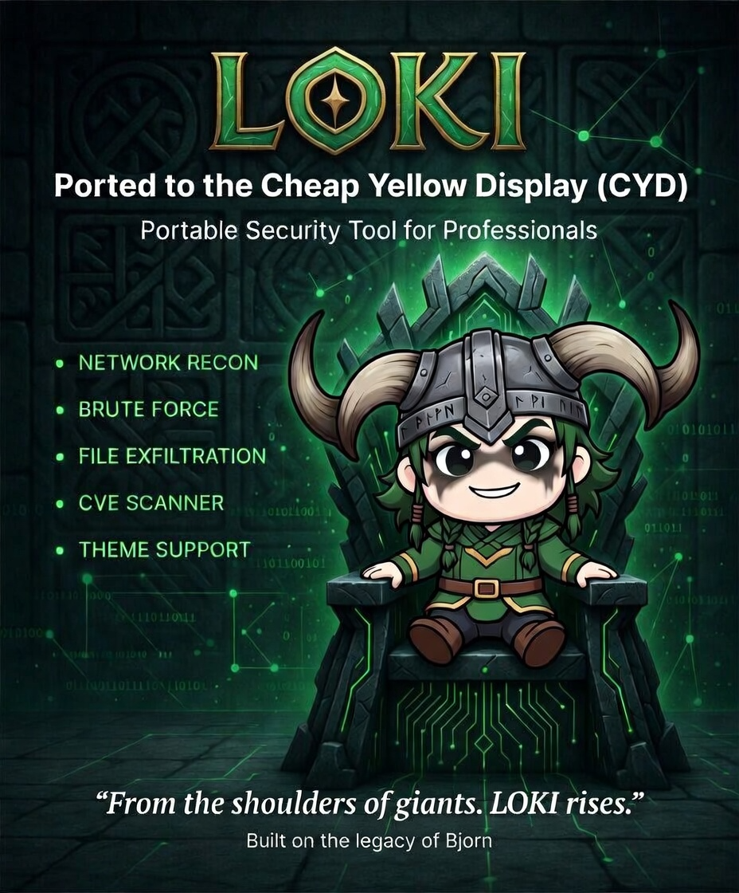
</p>

Loki CYD is a Tamagotchi-style pentesting companion that autonomously scans networks, discovers hosts, identifies services, brute forces credentials, and displays everything through an animated virtual pet interface on the ESP32 CYD touchscreen.

<p align="center">
  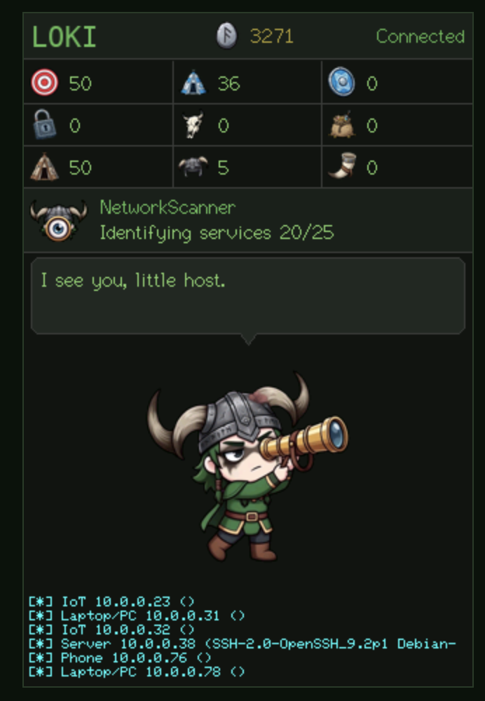
  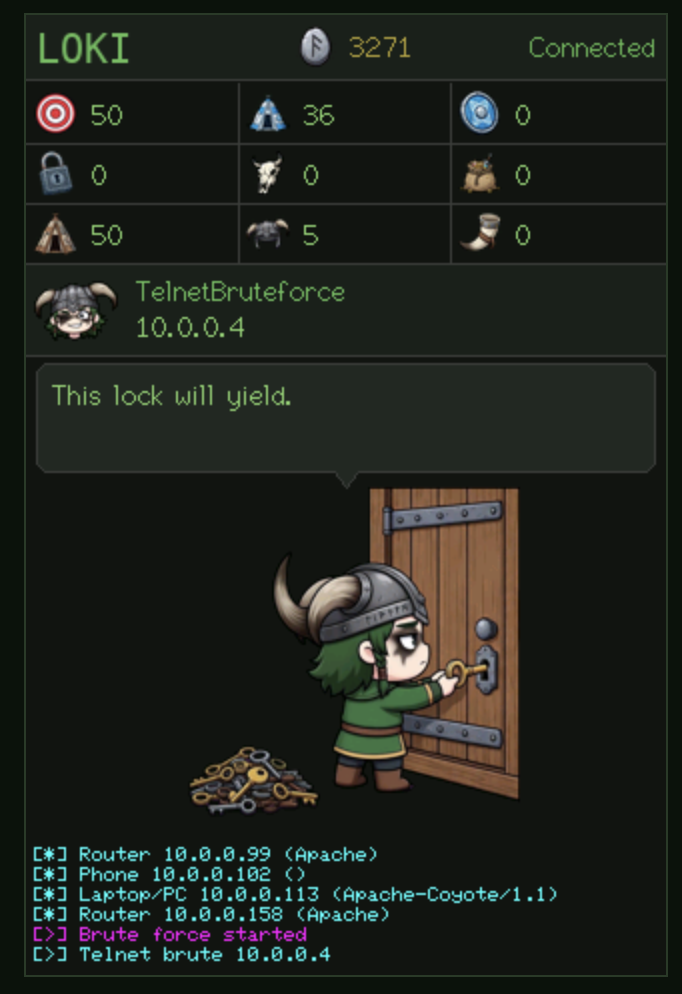
  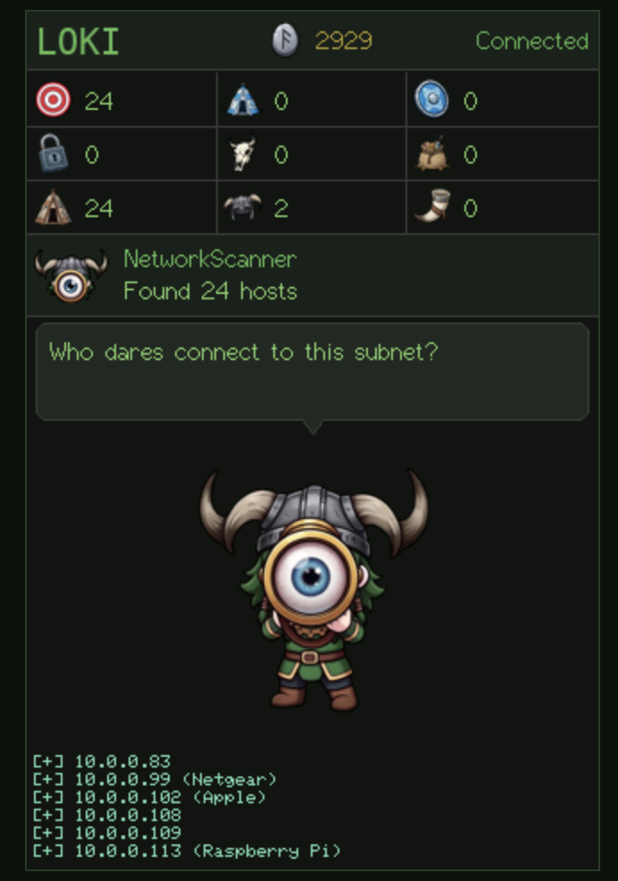
</p>

<p align="center">
  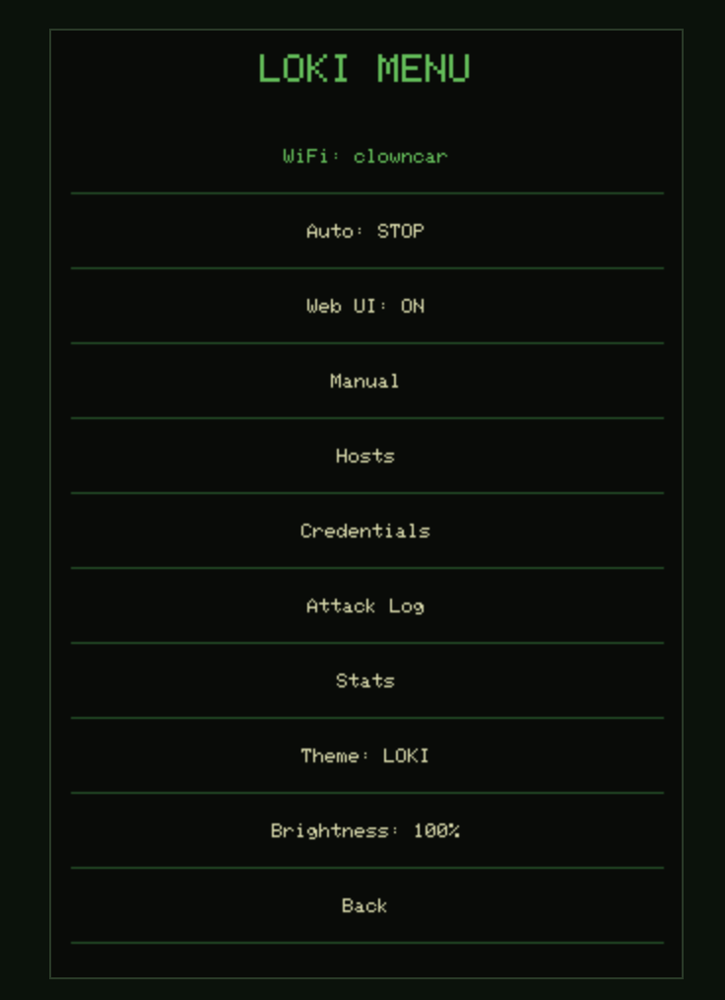
  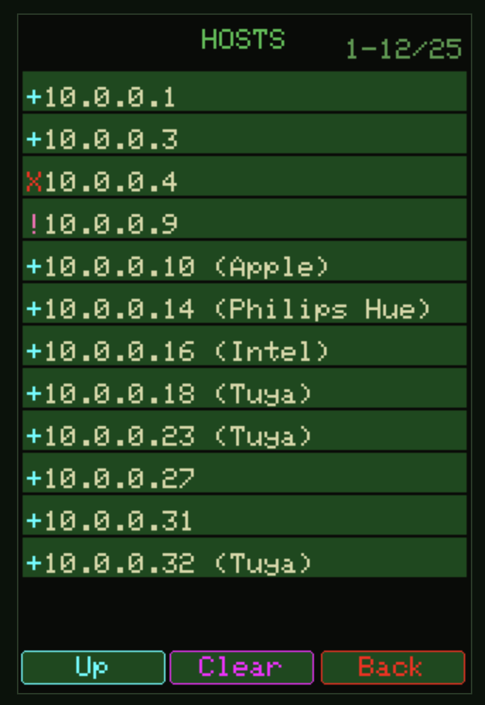
  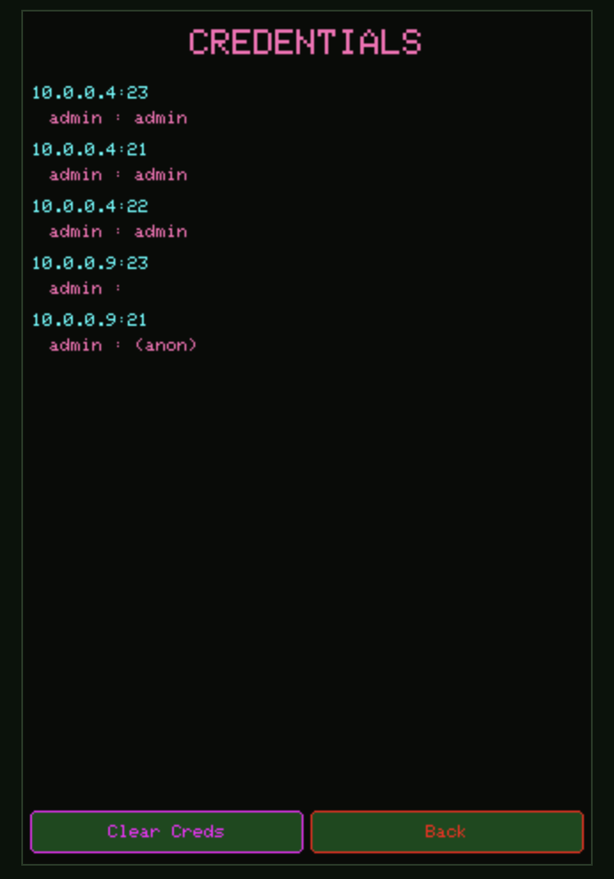
</p>

<p align="center">
  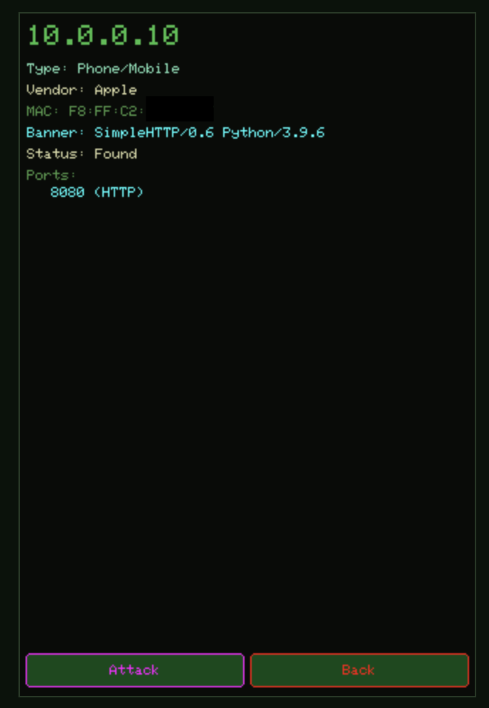
  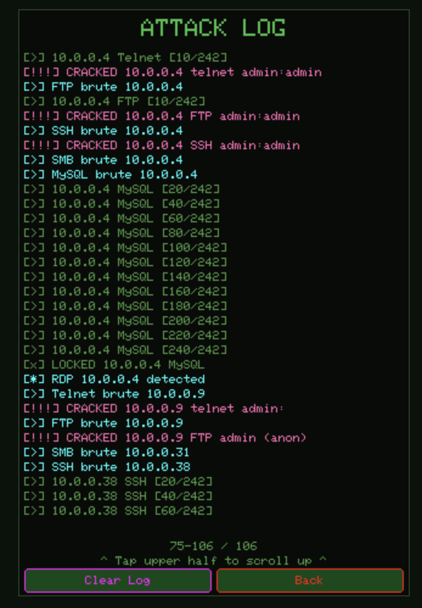
  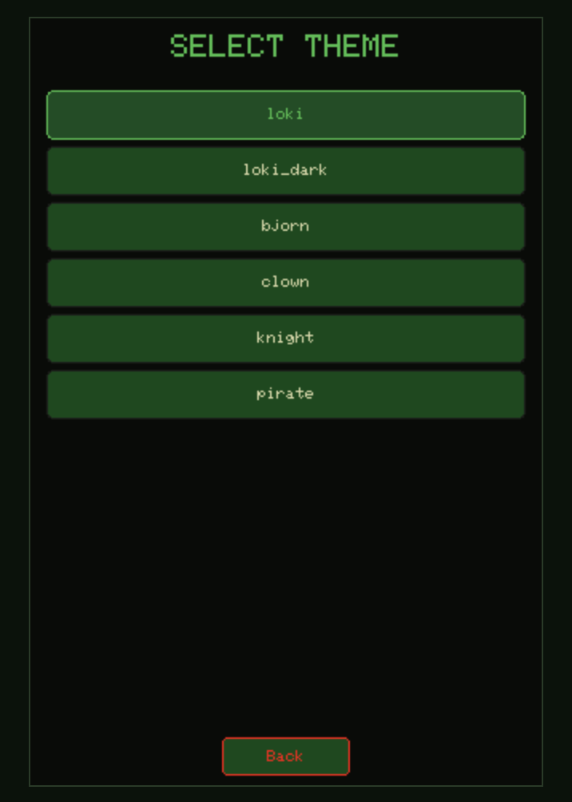
</p>

<p align="center">
  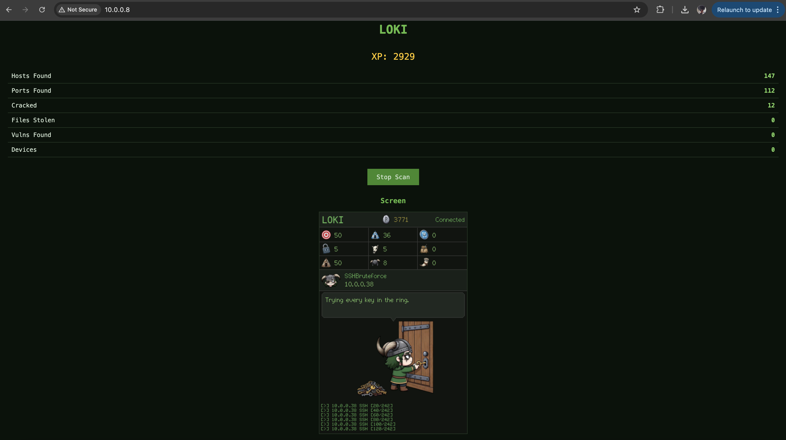
</p>

## Status

> **Active Development** — Loki CYD is under active development. The theme system is being restructured to match the original Loki's subfolder-based format with full per-theme customization. The Web UI is about to receive a major overhaul to replicate the original Loki's multi-tab dashboard with host management, attack controls, and live monitoring. See the feature comparison matrix below for current vs planned capabilities.

## Inspiration & Credits

This project is a port of [Loki](https://github.com/pineapple-pager-projects/pineapple_pager_loki) (originally built for the WiFi Pineapple Pager) to the ESP32 Cheap Yellow Display platform.

The original Loki was itself inspired by [Bjorn](https://github.com/infinition/Bjorn) — the autonomous network reconnaissance Tamagotchi.

Special thanks to [HaleHound-CYD](https://github.com/JesseCHale/HaleHound-CYD) by JesseCHale — an excellent offensive security toolkit for the CYD that demonstrated what's possible on this hardware. HaleHound's IoT Recon module, touch handling, display architecture, and SPI bus management provided invaluable reference for understanding the CYD platform. Some early development was done as a fork of HaleHound before Loki CYD became its own project.

## Features

### Virtual Pet UI
- Animated character with per-state sprite animations (idle, scanning, attacking, stealing, etc.)
- 3x3 stat grid with themed icons (Hosts, Ports, Vulns, Creds, Zombies, Data, NetworkKB, Level, Attacks)
- XP counter with gold rune icon
- Status bar with 42x42 animated status icon + two-line status text
- Speech bubble with randomized Loki-themed commentary
- 6-line color-coded attack log (kill feed)
- WiFi connection status indicator

### Network Reconnaissance
- **ARP Host Discovery** — same method as `nmap -sn` on local networks. Batched ARP scanning finds all alive hosts on the subnet.
- **Port Scanning** — TCP connect scan on 9 target ports per discovered host
- **Service Identification** — Banner grabbing for HTTP, FTP, SSH, Telnet, MySQL with device fingerprinting
- **MAC OUI Vendor Lookup** — 9,673 vendor entries with binary search identify device manufacturers (Apple, Samsung, Cisco, etc.)
- **Device Classification** — Vendor + port analysis classifies devices as Phone, Laptop, Router, Camera, NAS, Printer, IoT, Server, etc.

### Brute Force Attacks
- **SSH** — Real SSH password authentication via LibSSH-ESP32
- **FTP** — USER/PASS protocol with anonymous login detection
- **Telnet** — Login/password prompt detection with shell verification
- **HTTP/HTTPS** — Basic auth brute force (ports 80, 443, 8080)
- **MySQL** — Empty password / no-auth detection
- **SMB** — Service detection and negotiate probe (full NTLM in development)
- **RDP** — Service detection (full CredSSP/NLA in development)

### Credential Management
- Loki's original dictionary: 11 usernames × 20 passwords = 242 credential combinations
- Custom wordlist support via SD card (`/loki/creds.txt`)
- All cracked credentials stored with IP, port, username, password
- Credentials persist to SPIFFS flash (survives reboots)
- Downloadable via web UI

### Theme System
- **Built-in fallback theme** — 7 still sprites + background in PROGMEM, works without SD card
- **SD card animated themes** — Full animation with 50-300 frames per theme
- **6 themes included** — Loki, Loki Dark, Bjorn, Clown, Knight, Pirate
- **Fully customizable** — Colors, layout coordinates, animation timing all configurable via `theme.cfg`
- **Theme picker** — Switch themes from the touchscreen menu
- See [THEME_DEVELOPMENT.md](THEME_DEVELOPMENT.md) for creating custom themes

### Touch Interface
- 11-item main menu (WiFi, Auto, Web UI, Manual, Hosts, Credentials, Attack Log, Stats, Theme, Brightness, Back)
- WiFi network picker with signal strength bars
- On-screen QWERTY keyboard (lower/upper/symbols) with show/hide password toggle
- Scrollable host list with device details
- Manual attack selection per host
- Touch calibration on first boot (3.5" displays)
- Brightness control (25/50/75/100%)

### Web UI
- Dashboard with live stats at `http://<cyd-ip>/`
- `/creds` — JSON credentials download
- `/log` — Plain text attack log
- `/screenshot` — Live BMP screenshot of the display
- `/files` — SPIFFS file listing
- `/download?file=<path>` — Download any stored file
- `/stats` — JSON stats API
- `/start` and `/stop` — Scan control

### Persistence
- **WiFi credentials** — saved to NVS, auto-reconnects on boot
- **Scan results** — credentials, devices, attack log saved to SPIFFS
- **Scores** — XP and all stats persist across reboots
- **Web UI setting** — on/off state persists
- **SD card** — optional, used for themes, loot storage, custom wordlists, scan reports

## Supported Hardware

| Board | Display | Touch | Status |
|-------|---------|-------|--------|
| QDtech E32R35T | 3.5" ST7796 320x480 | Resistive | Primary target, fully tested |
| ESP32-2432S028 | 2.8" ILI9341 240x320 | Resistive | 📋 Planned |
| QDtech E32R28T | 2.8" ILI9341 (Type-C) | Resistive | 📋 Planned |
| ESP32-3248S035C | 3.5" ILI9488 480x320 | Capacitive | 📋 Planned |
| ESP32-8048S043 | 4.0" ST7262 800x480 | Capacitive | 📋 Planned |

## Installation

### Requirements
- ESP32 CYD board (3.5" E32R35T currently supported)
- MicroSD card (optional, for themes and loot storage)
- USB cable for flashing

### Quick Flash (No Install Required)

Pre-built binaries are available in the `binaries/` folder.

1. Open [ESP Web Flasher](https://esp.huhn.me) in **Chrome**, **Edge**, or **Opera** (Firefox/Safari not supported)
2. Click **Connect** and select your board's serial port
3. Set address to: **0x0**
4. Click **Choose File** and select `loki-cyd-e32r35t-FULL.bin`
5. Click **Program**
6. Wait for completion, then power cycle the board

### Build from Source

Requires [PlatformIO](https://platformio.org/) (CLI or VSCode extension).

```bash
# Clone
git clone https://github.com/brainphreak/cyd_loki.git
cd cyd_loki

# Build for 3.5" display
pio run -e esp32-e32r35t

# Flash
pio run -e esp32-e32r35t -t upload
```

### SD Card Setup (Optional but Recommended)

The SD card provides animated themes (6 included), loot storage, and custom wordlists. Without it, Loki CYD runs with a built-in still-image theme.

**Quick setup:** Copy the `sdcard_contents/loki/` folder from this repo to the root of a FAT32-formatted MicroSD card.

**Generate themes** from the original Loki project's theme assets:
```bash
# Generate a single theme
python3 tools/make_theme_sdcard.py <original_loki_theme_dir> sdcard_output --name loki --screen 320x480 --sprite 175

# Copy to SD card
cp -R sdcard_output/loki/ /path/to/sdcard/loki/
```

**SD card structure:**
```
SD card root/
└── loki/
    ├── themes/
    │   ├── loki/        ← 302 animation frames + bg + config
    │   ├── bjorn/
    │   ├── clown/
    │   ├── knight/
    │   ├── loki_dark/
    │   └── pirate/
    ├── loot/             ← Stolen files (auto-created)
    ├── reports/          ← Scan reports (auto-created)
    └── creds.txt         ← Custom wordlist (optional)
```

**Custom wordlist** (`creds.txt`):

The firmware has 242 credential combinations built-in (11 usernames × 20 passwords + blank/same-as-user). The `creds.txt` file on the SD card adds **additional** credentials on top of these — you don't need to repeat the built-in ones. Only add target-specific or unusual credentials:
```
# These are IN ADDITION to the 242 built-in combos
# Only add extras specific to your targets
operator:changeme
cisco:cisco
```

## Feature Comparison

### Loki CYD vs Original Loki (Pager)

| Feature | Pager Loki | CYD Loki | Status |
|---------|-----------|----------|--------|
| ARP Host Discovery | ✅ (via nmap) | ✅ (native ARP) | ✅ Complete |
| Port Scanning | ✅ (40 ports) | ✅ (9 ports) | ⚡ Expanding |
| SSH Brute Force | ✅ (paramiko) | ✅ (LibSSH-ESP32) | ✅ Complete |
| FTP Brute Force | ✅ | ✅ | ✅ Complete |
| Telnet Brute Force | ✅ | ✅ | ✅ Complete |
| HTTP Brute Force | ✅ | ✅ | ✅ Complete |
| SMB Brute Force | ✅ (pysmb) | 🔄 Detection only | 🚧 In Progress |
| MySQL Brute Force | ✅ (pymysql) | 🔄 Empty password | 🚧 In Progress |
| RDP Brute Force | ✅ (xfreerdp) | 🔄 Detection only | 🚧 In Progress |
| Vulnerability Scanning | ✅ (nmap NSE) | ❌ | 📋 Planned |
| File Stealing (FTP) | ✅ | ❌ | 📋 Planned |
| File Stealing (SSH) | ✅ | ❌ | 📋 Planned |
| File Stealing (SMB) | ✅ | ❌ | 📋 Planned |
| File Stealing (Telnet) | ✅ | ❌ | 📋 Planned |
| SQL Data Theft | ✅ | ❌ | 📋 Planned |
| MAC OUI Vendor Lookup | ✅ | ✅ (9,673 built-in + 35,000+ on SD) | ✅ Complete |
| Device Classification | ✅ | ✅ | ✅ Complete |
| OS Detection | ✅ (nmap) | ❌ | 📋 Planned |
| Hostname Resolution | ✅ (DNS/NetBIOS/mDNS) | ❌ | 📋 Planned |
| Virtual Pet UI | ✅ | ✅ | ✅ Complete |
| Theme System | ✅ (6 themes) | ✅ (6 themes) | 🚧 In Progress |
| Theme Colors | ✅ | ✅ | 🚧 In Progress |
| Theme Layout Override | ✅ | ✅ | 🚧 In Progress |
| Character Animations | ✅ (all frames) | ✅ (all frames) | ✅ Complete |
| Sequential/Random Anim | ✅ | ✅ | ✅ Complete |
| Commentary System | ✅ | ✅ | ✅ Complete |
| Web UI — Dashboard | ✅ (full SPA) | 🔄 Basic | 🚧 In Progress |
| Web UI — Hosts Tab | ✅ | 🔄 JSON API | 🚧 In Progress |
| Web UI — Attacks Tab | ✅ | ❌ | 📋 Planned |
| Web UI — Loot Tab | ✅ | 🔄 JSON API | 🚧 In Progress |
| Web UI — Config Tab | ✅ | ❌ | 📋 Planned |
| Web UI — Terminal | ✅ | ❌ | N/A (no shell) |
| Web UI — Display Tab | ✅ | ✅ (screenshot) | ✅ Complete |
| Battery Indicator | ✅ | ❌ | N/A (no battery) |
| App Handoff | ✅ | ❌ | N/A (single app) |
| Manual Target Entry | ✅ | 🔄 | 🚧 In Progress |
| Attack Log Persistence | ✅ | ✅ (SPIFFS) | ✅ Complete |
| Credential Persistence | ✅ | ✅ (SPIFFS + NVS) | ✅ Complete |
| WiFi Auto-Reconnect | N/A | ✅ | ✅ Complete |
| Brightness Control | ✅ | ✅ | ✅ Complete |
| Touch Calibration | N/A | ✅ | ✅ Complete |
| Screenshot Capture | ✅ | ✅ (via web) | ✅ Complete |

## Architecture

- **Dual-core**: Core 0 = recon engine, Core 1 = UI + touch + web server
- **Thread-safe**: Dirty flag system prevents SPI bus conflicts between cores
- **Flash**: ~72% used (with PROGMEM fallback theme)
- **RAM**: ~25% used
- See [ARCHITECTURE.md](ARCHITECTURE.md) for full technical documentation

## Tools

| Tool | Description |
|------|-------------|
| `tools/make_background.py` | Generate composite background BMP for a theme |
| `tools/convert_sprites.py` | Convert PNG character sprites to RGB565 BMP |
| `tools/make_theme_sdcard.py` | Build complete SD card theme package |
| `tools/bmp_to_progmem.py` | Convert BMP to PROGMEM C header arrays |
| `tools/make_oui_db.py` | Generate OUI vendor lookup table from nmap database |
| `tools/preview_ui.py` | Generate preview mockup of the UI |

## License

This project builds upon work from multiple open-source projects. Please respect their respective licenses.

## Links

- [Original Loki (WiFi Pineapple Pager)](https://github.com/pineapple-pager-projects/pineapple_pager_loki)
- [Bjorn](https://github.com/infinition/Bjorn)
- [HaleHound-CYD](https://github.com/JesseCHale/HaleHound-CYD)
